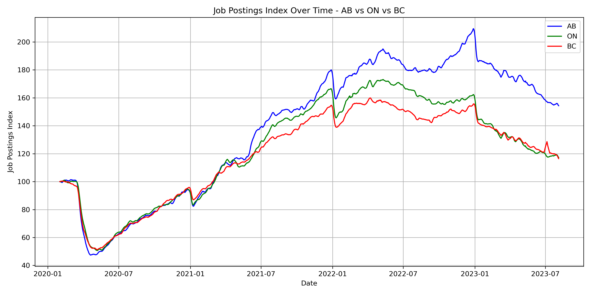
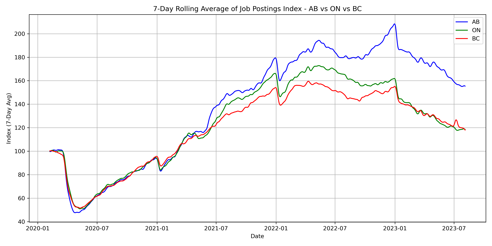

# Canadian Job Trends Analysis (2020-2023)
This project analyzes job posting trends across Canadian provinces using the Indeed Job Postings Index dataset. It focused on Alberta, Ontario, and British Columbia.

---

## Dataset
- **Source**: [Kaggle - Indeed Job Posting Index (Canada)](https://www.kaggle.com/datasets/reet1992/indeed-job-posting-index-canada?resource=download)
- **File**: 'provincial_postings_ca.csv'
- **Time Range**: Feb 2020 - mid-2023
- **Unit**" Normalized index (baseline = 100 on Feb 1, 2020)

---

## Visualizations
### Raw Comparison - AB vs ON vs BC

### 7-Day Rolling Average

---

## Project Structure 
- 'images/' - All charts and plots
- 'provincial_postings_ca.csv' - Dataset
- 'job_trends_analysis.ipynb' - Notebook
- 'requirements.txt' - Dependencies
- 'README.md' - Project Overview
